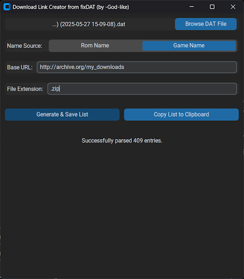

# Download Link Creator from fixDAT

A simple desktop application built with Python and CustomTkinter to generate a list of download URLs (for external tools like rclone or jDownloader) based on entries in a RomVault-style fixDat file.

## Features

* **DAT File Loading:** Supports `.dat` and `.xml` fixDat files.
* **Name Source Selection:** Use a segmented button to choose between "Rom Name" or "Game Name" for link generation.
* **Customizable URL & Extension:** Input fields for the base download URL and the desired file extension.
* **URL Generation:** Creates a list of URLs by combining: `Base URL` + `Selected Name` + `File Extension`.
* **Save to File:** Export the generated URL list as a `.txt` file, with one URL per line.
* **Copy to Clipboard:** Directly copy the entire URL list to the system clipboard.
* **User-Friendly Interface:** Built with CustomTkinter for a modern look and feel.
* **Status Feedback:** An in-app status bar provides information about operations (file loading, parsing, saving, copying, errors).



## How to Run

1. Prebuilt Windows Binary
   * No requirements
   * Download newest binary under releases


## Installation (from source)

1.  **Ensure Python 3 is installed.** You can download it from [python.org](https://www.python.org/).
2.  **Install the CustomTkinter library.** Open your terminal or command prompt and run:
    ```bash
    pip install customtkinter
    ````
3.  Save the application code as a Python file (e.g., `download_links_from_fixdat.py`).
4.  Open your terminal or command prompt.
5.  Navigate to the directory where you saved the file.
6.  Run the script using:
    ```bash
    python download_links_from_fixdat.py
    ```

## How to Use

1.  **Browse DAT File:** Click the "Browse DAT File" button to select your RomVault fixDat file. The status bar will indicate if the file is loaded and parsed successfully.
2.  **Select Name Source:** Click on "Rom Name" or "Game Name" in the "Name Source" selector to choose which name attribute from the DAT file will be used in the URL.
3.  **Enter Base URL:** Type the base path of your download source into the "Base URL" field (e.g., `http://archive.org/download/myromset`).
4.  **Enter File Extension:** Type the desired file extension for your roms/games into the "File Extension" field (e.g., `.zip`, `7z`). A leading dot `.` will be automatically added if not provided.
5.  **Generate List:**
    * Click **"Generate & Save List"** to create the URL list and be prompted to save it to a text file.
    * Click **"Copy List to Clipboard"** to create the URL list and copy it directly to your system clipboard.
6.  **Check Status:** The status bar at the bottom of the window will provide feedback on these actions.

## DAT File Parsing Notes

* The application primarily looks for `<game>` elements and their `name` attribute (for "Game Name").
* Within each `<game>` element, it looks for the first `<rom>` element and its `name` attribute (for "Rom Name").
* If a game name is missing, it may try to use the rom name, and vice-versa.
* A fallback allows parsing top-level `<rom>` elements if no `<game>` elements are found, using the rom's name for both fields.
* This structure is common for many XML-based DAT files (e.g., Logiqx format, MAME ListXML derivatives). If your fixDat file has a significantly different XML structure, the parsing might not extract names correctly.

---
